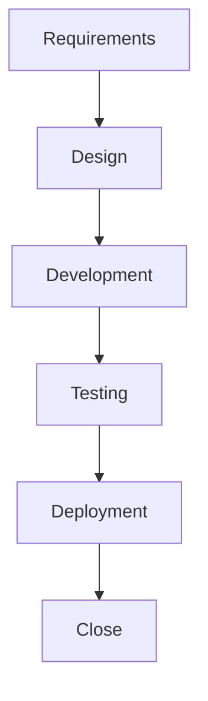

# Project and Enhancement Story Flow

## Overview

The Project and Enhancement Story Flow defines the complete lifecycle of how stories move from conception to completion. This chapter details each phase of development and the processes that ensure quality delivery.

## Contents

### Requirements Phase
- [Requirements Clarification](requirements/clarification.md)
- [User Story Development](requirements/user-stories.md)
- [Acceptance Criteria](requirements/acceptance-criteria.md)

### Design Phase
- [Design Principles](design/principles.md)
- [Design Documentation](design/documentation.md)
- [Design Review Process](design/review-process.md)

### Development Phase
- [Environment Setup](development/environment-setup.md)
- [Code Development](development/coding-standards.md)
- [Unit Testing](development/unit-testing.md)
- [Code Review](development/code-review.md)

### Testing Phase
- [Testing Strategy](testing/strategy.md)
- [SIT Process](testing/sit-process.md)
- [MOT Guidelines](testing/mot-guidelines.md)
- [UAT Procedures](testing/uat-procedures.md)

### Deployment Phase
- [Deployment Planning](deployment/planning.md)
- [Implementation](deployment/implementation.md)
- [Verification](deployment/verification.md)
- [Post-Deployment](deployment/post-deployment.md)

## Process Flow Diagram

## Quick Reference

| Phase | Key Deliverables | Required Approvals |
|-------|-----------------|-------------------|
| Requirements | User Story, Acceptance Criteria | Business Stakeholder |
| Design | Technical Design, Review Notes | Architecture Team |
| Development | Code, Unit Tests | Technical Lead |
| Testing | Test Results, Bug Reports | QA Lead |
| Deployment | Deployment Plan, Release Notes | Release Manager |

## Best Practices

- Clear documentation at each phase
- Regular stakeholder communication
- Proper approval processes
- Quality gates enforcement

## Navigation

- [Previous: Story Prioritization](../05-story-prioritization/README.md)
- [Next: Break-fix Story Process](../07-break-fix/README.md)
- [Back to Main](../../README.md)
