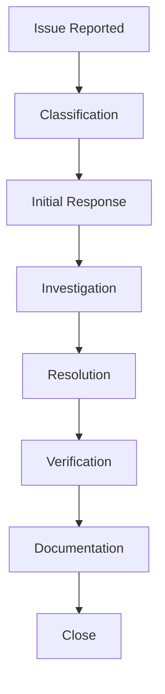

# Break-fix Story Process

## Overview

The Break-fix process handles urgent production issues that require immediate attention. This chapter details the procedures, roles, and workflows for managing break-fix situations effectively.

## Contents

### Process Components
- [Issue Classification](classification.md)
- [Response Procedures](response.md)
- [Resolution Process](resolution.md)
- [Verification Steps](verification.md)

### Support Structure
- [Team Organization](team-organization.md)
- [Communication Guidelines](communication.md)
- [Escalation Procedures](escalation.md)

### Documentation
- [Tracking Requirements](tracking.md)
- [Root Cause Analysis](root-cause.md)
- [Lessons Learned](lessons-learned.md)

## Process Flow Diagram

## Quick Reference

| Phase | Key Activities | Required Approvals |
|-------|---------------|-------------------|
| Classification | Severity Assessment, Impact Analysis | Support Lead |
| Response | Initial Investigation, Communication | Technical Lead |
| Resolution | Fix Development, Testing | Development Lead |
| Verification | Testing, User Validation | QA Lead, Business Owner |

## Best Practices

- Immediate response to critical issues
- Clear communication channels
- Proper documentation
- Root cause analysis
- Prevention measures

## Navigation

- [Previous: Project Flow](../06-project-flow/README.md)
- [Next: Hot Fix Process](../08-hot-fix/README.md)
- [Back to Main](../../README.md)
