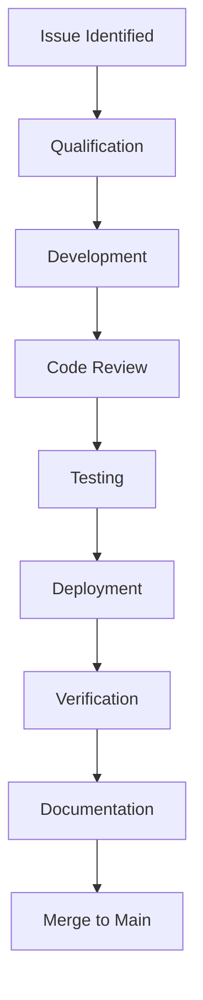

# Hot Fix Process

## Overview

The Hot Fix process handles critical production issues that require immediate code changes. This chapter details the expedited procedures for implementing, testing, and deploying urgent fixes while maintaining code quality and system stability.

## Contents

### Process Components
- [Qualification](qualification.md)
- [Development Process](development.md)
- [Testing Requirements](testing.md)
- [Deployment Process](deployment.md)

### Quality Control
- [Code Standards](code-standards.md)
- [Review Process](review-process.md)
- [Testing Guidelines](testing-guidelines.md)

### Documentation
- [Change Management](change-management.md)
- [Version Control](version-control.md)
- [Release Notes](release-notes.md)

## Process Flow Diagram

## Quick Reference

| Phase | Key Activities | Required Approvals |
|-------|---------------|-------------------|
| Qualification | Impact Assessment, Priority Validation | Product Owner, Technical Lead |
| Development | Code Changes, Unit Testing | Senior Developer |
| Review | Code Review, Standards Check | Technical Lead |
| Testing | Integration Test, Regression Test | QA Lead |
| Deployment | Production Release, Verification | Release Manager |

## Hot Fix Criteria

### Qualifying Factors
- Critical business impact
- Production system affected
- No viable workaround
- Immediate action required

### Priority Levels
1. **Emergency**
   - System down
   - Data corruption
   - Security breach
   - Revenue impact

2. **Critical**
   - Major function
   - Multiple users
   - Performance
   - Compliance

## Best Practices

### Process Guidelines
- Maintain code quality
- Minimize scope
- Complete testing
- Clear communication
- Proper documentation

### Quality Controls
- Code review required
- Test coverage
- Regression checks
- Deployment validation

## Navigation

- [Previous: Break-fix Process](../07-break-fix/README.md)
- [Next: Project Management](../09-project-management/README.md)
- [Back to Main](../../README.md)
